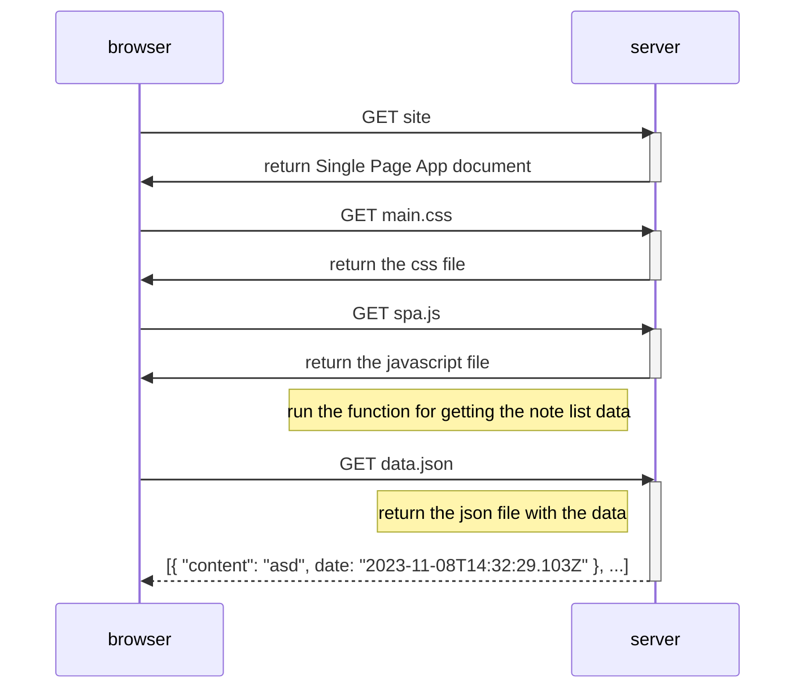
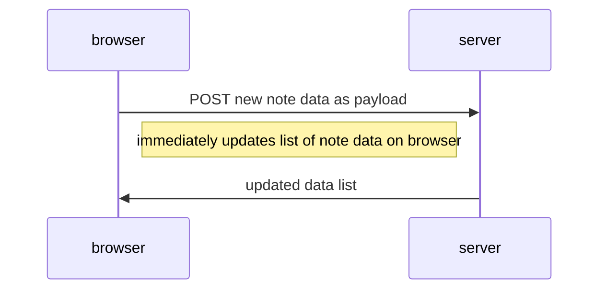

# Single Page App

```mermaid
sequenceDiagram
    participant browser
    participant server
    
    browser ->> server: GET site
    activate server
    server ->> browser: return Single Page App document
    deactivate server
    
    browser ->> server: GET main.css
    activate server
    server ->> browser: return the css file
    deactivate server
    
    browser ->> server: GET spa.js
    activate server
    server ->> browser: return the javascript file
    deactivate server
    Note left of server: run the function for getting the note list data
    
    browser ->> server: GET data.json
    activate server
    note left of server: return the json file with the data
    server -->> browser: [{ "content": "asd", date: "2023-11-08T14:32:29.103Z" }, ...]
    deactivate server
```

## Sending note

```mermaid
sequenceDiagram
    participant browser
    participant server
    
    browser->>server: POST new note data as payload
    note right of browser: immediately updates list of note data on browser
    server->>browser: updated data list

```
