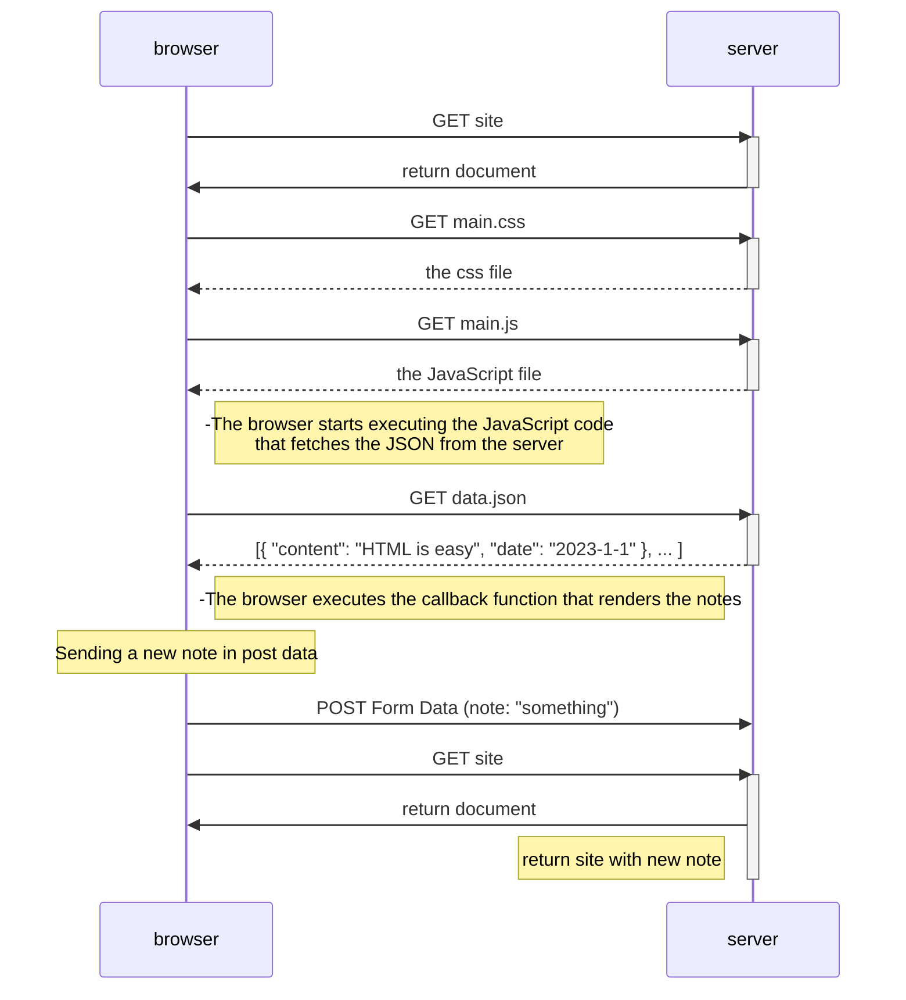

```mermaid
sequenceDiagram
    participant browser
    participant server
    
    browser->>server: GET site
    activate server
    server->>browser: return document
    deactivate server

    browser->>server: GET main.css
    activate server
    server-->>browser: the css file
    deactivate server

    browser->>server: GET main.js
    activate server
    server-->>browser: the JavaScript file
    deactivate server

    Note right of browser: -The browser starts executing the JavaScript code<br>that fetches the JSON from the server

    browser->>server: GET data.json
    activate server
    server-->>browser: [{ "content": "HTML is easy", "date": "2023-1-1" }, ... ]
    deactivate server

    Note right of browser: -The browser executes the callback function that renders the notes
    
    Note over browser: Sending a new note in post data
    browser ->> server: POST Form Data (note: "something")
    browser ->> server: GET site
    activate server
    server ->> browser: return document
    Note left of server: return site with new note
    deactivate server
```
